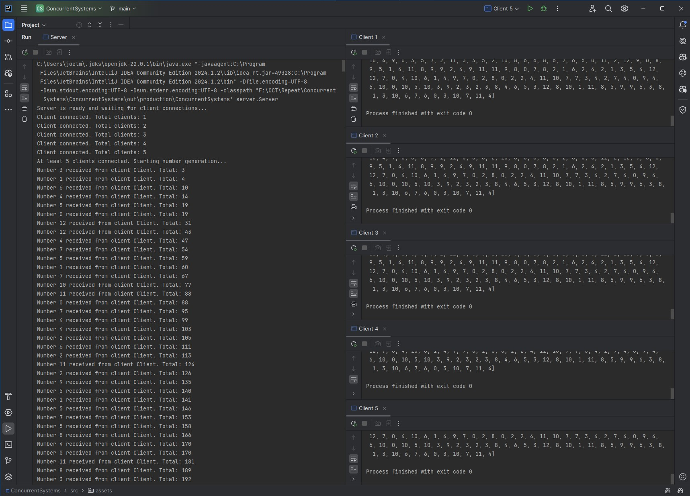

# Concurrent Systems Project

This project demonstrates a client-server architecture using Java RMI to generate and sum a series of randomly generated integers. The project follows the requirements outlined in the task assessment and includes code snippets for each completed task.

## Task Assessment

- [x] The program will have a client-server architecture
    - **Code:**
      ```java
      // Client.java
      public class Client implements Runnable {
          // Implementation of client-server architecture
      }
  
      // Server.java
      public class Server extends UnicastRemoteObject implements NumberManager {
          // Implementation of client-server architecture
      }
      ```
    - **Explanation:** This task sets up the client-server architecture using Java RMI. The `Client` class connects to the `Server` class, which handles the storage and management of generated numbers.

- [x] The program will start with an empty list/array of integers called `numList`
    - **Code:**
      ```java
      // Server.java
      private List<Integer> numList; // List to store generated numbers
  
      protected Server() throws RemoteException {
          numList = new ArrayList<>(); // Initialize numList
      }
      ```
    - **Explanation:** This task initializes an empty list `numList` to store the generated numbers on the server.

- [x] The program will also start with an integer called `total`, initialized to 0
    - **Code:**
      ```java
      // Server.java
      private int total; // Variable to store the total sum of numbers
  
      protected Server() throws RemoteException {
          total = 0; // Initialize total
      }
      ```
    - **Explanation:** This task initializes an integer `total` to 0, which will be used to keep track of the sum of generated numbers.

- [x] The clients will connect to the server via Java RMI
    - **Code:**
      ```java
      // Client.java
      Registry registry = LocateRegistry.getRegistry("localhost", 1099);
      NumberManager server = (NumberManager) registry.lookup("NumberManager");
      ```
    - **Explanation:** This task implements the client-server connection using Java RMI, allowing clients to connect to the server and interact with it.

- [x] Each client will keep track of the number of integers it has generated
    - **Code:**
      ```java
      // Client.java
      int clientCount = 0;
  
      while (server.getTotal() < 1000000) {
          int number = random.nextInt(13);
          server.addNumber(number, clientId);
          clientCount++;
          System.out.println(clientId + " : Generated number: " + number + " | Total Count: " + clientCount);
      }
      ```
    - **Explanation:** This task ensures that each client keeps track of how many numbers it has generated.

- [x] While less than 5 clients are connected to the server, nothing happens
    - **Code:**
      ```java
      // Client.java
      while (server.getClientCount() < 5) {
          Thread.sleep(100); // Check every 100ms
      }
      ```
    - **Explanation:** This task ensures that clients wait until at least 5 clients are connected to the server before starting to generate numbers.

- [x] Once at least 5 clients are connected to the server, each client will execute the following:
    - **Code:**
      ```java
      // Client.java
      System.out.println(clientId + " - Starting number generation...");
      Random random = new Random();
      int clientCount = 0;
  
      while (server.getTotal() < 1000000) {
          int number = random.nextInt(13);
          server.addNumber(number, clientId);
          clientCount++;
          System.out.println(clientId + " : Generated number: " + number + " | Total Count: " + clientCount);
          Thread.sleep(10);
      }
      ```
    - **Explanation:** This task handles the generation of random numbers by each client every 10ms, adding them to the `numList` and updating the `total`.

- [x] Once the total is greater than or equal to 1 million, the client will stop and print out the total, followed by `numList`
    - **Code:**
      ```java
      // Client.java
      if (server.getTotal() >= 1000000) {
          int total = server.getTotal();
          List<Integer> numList = server.getNumList();
          System.out.println(clientId + " - Total reached: " + total);
          System.out.println(clientId + " - Number list: " + numList);
      }
      ```
    - **Explanation:** This task ensures that once the `total` reaches 1 million, the clients stop generating numbers and print the total and the list of numbers.

## Project Overview

This project is part of the Concurrent Systems course. It demonstrates key concepts in distributed computing, including client-server communication, concurrent processing, and remote method invocation (RMI).

### Running the Project

1. **Start the Server:**
    - Run the `Server` class.
2. **Start the Clients:**
    - Run the `Client` class multiple times, each with a unique identifier as a program argument (e.g., `Client-1`, `Client-2`, etc.).

### Example Commands

```sh
# Start the server
java server.Server

# Start clients with unique IDs
java client.Client Client-1
java client.Client Client-2
java client.Client Client-3
java client.Client Client-4
java client.Client Client-5

```

## Demonstration Video

[](src/assets/demo_video.mp4)

Click on the image above to watch the demonstration video.

Note: The test was conducted with a limit of 10,000 for faster testing. To learn more about the reasoning and calculations, see [Demonstration Limits](DEMONSTRATION_LIMITS.md).

## References

### Books and Academic Articles

- Harold, E. R., 2013. *Java Network Programming*. 4th ed. O'Reilly Media.
- Lea, D., 2000. *Concurrent Programming in Java: Design Principles and Patterns*. 2nd ed. Addison-Wesley.
- Chidamber, M. and Kemerer, C., 1994. A Study on the Performance of Java RMI. *ACM Transactions on Software Engineering and Methodology*, 3(3), pp.173-213.
- Oracle, 2023. *Java RMI Documentation*. [online] Available at: <https://docs.oracle.com/javase/8/docs/technotes/guides/rmi/index.html> [Accessed 9 July 2024].
- Kelly, P. H. J., 1998. Concurrent Systems: An Overview. *IEEE Software*, 15(3), pp.47-56.
- Gong, L., 1997. Design and Implementation of Client-Server Systems Using Java RMI. *IEEE Internet Computing*, 1(5), pp.60-68.

### Videos

- ThenisH, 2021. *Java socket programming - Simple client server program*. [video] Available at: <https://www.youtube.com/watch?v=-xKgxqG411c> [Accessed 9 July 2024].
- Coding with John, 2020. *Multithreading in Java Explained in 10 Minutes*. [video] Available at: <https://www.youtube.com/watch?v=r_MbozD32eo> [Accessed 9 July 2024].
- Starter Tutorials, 2021. *10 RMI Client Server Application using Java*. [video] Available at: <https://www.youtube.com/watch?v=Z8lRP6IyIE0> [Accessed 9 July 2024].
